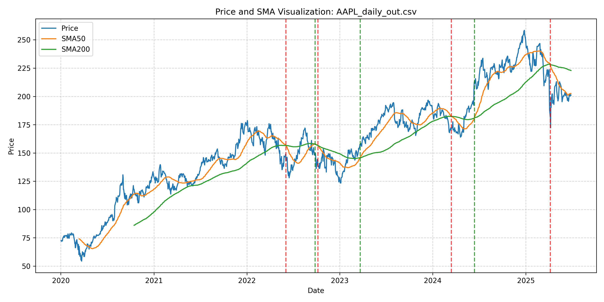

# SMA Crossover Analyzer

A lightweight toolkit for detecting simple moving-average (SMA) crossovers in historical price data using C++.



## What it does
1. Downloads daily price data for a chosen stock symbol (see `download_data.py`).
2. Computes short- and long-term SMAs and identifies **golden** (bullish) and **death** (bearish) crosses using the C++ core (`main.cpp` and helpers).
3. Generates two CSV files:
   * `<symbol>_daily_out.csv` – price series plus SMA columns.
   * `<symbol>_daily_crossovers.csv` – dates and types of crossover events.
4. Provides a Python visualizer (`visualize_output.py`) to plot prices, SMAs, and crossover points.

## Quick start
```bash
# 1. Fetch price history (default: AAPL)
python download_data.py AAPL

# 2. Build and run the analyzer (requires a C++17 compiler)
g++ main.cpp SmaCalculator.cpp CsvReader.cpp CrossDetector.cpp -o sma_analyzer
./sma_analyzer AAPL_daily.csv

# 3. Visualize results
python visualize_output.py AAPL_daily_out.csv
```

## Requirements
* C++ compiler (e.g., g++, clang++)
* Python 3.8+ with `pandas`, `matplotlib`, `yfinance` (for `download_data.py`)

Install Python dependencies:
```bash
pip install matplotlib yfinance
```

---
This project was created for educational purposes and is **not** financial advice. 
